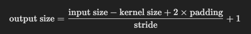
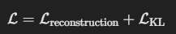
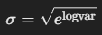
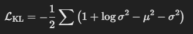

# Issues  
記錄我做這個project時遇到的問題, 不管我有沒有解決哈哈  

## 消除vscode的黃色warning底線  
這個我在網路上找到一些但試了之後黃色底線還是在  
然後網路上有人說習慣比解決更容易所以我就沒試了XD  
但如果有人知道希望可以告訴我因為我有強迫症看了好不爽哈哈  

## 重新命名anaconda的虛擬環境 
建一個新環境, 然後把舊環境刪掉  
``` 
conda create --name 新環境名字 --clone 舊環境名字  
```
我環境裡面有裝pytorch相關的東西, 我感覺會很麻煩所以我沒用哈哈  

## CNN-Conv2d知識點:  
```python
nn.Conv2d(1, 32, kernel_size=3, stride=2, padding=1)
```
+ stride=2: 圖片尺寸縮小一半, 用stride=1+MaxPool2d(2,2)有一樣的效果  
+ conv2d 卷積輸出尺寸計算公式:  
  

## VAE知識點:  
###  VAE 的基本架構  
+ VAE 的結構分為 Encoder、Latent Space（隱變數空間）和 Decoder 三部分：   
    Encoder：將輸入壓縮成潛在空間（latent space）的參數（均值 μ 和標準差 σ）    
    Latent Space：使用 reparameterization trick 從常態分佈中取樣 z    
    Decoder：將 z 解碼回原本的數據空間  

+ VAE 的 loss 由兩部分組成：  
  

+ VAE model Reparameterization:  
```python
def reparameterize(self, mu, logvar):
        std = torch.exp(0.5 * logvar)  # 計算標準差 σ
        eps = torch.randn_like(std)  # 取標準常態分布的隨機數
        return mu + eps * std  # 𝑧 = 𝜇 + 𝜎 * 𝜖
```
std = torch.exp(0.5 * logvar)  
計算標準差 σ:  
  

+ KL-divergence:   
定義: 衡量兩個機率分佈的差異，值越小表示兩者越接近  
KLD loss計算公式:  
  
```python
kl_loss = -0.5 * torch.sum(1 + logvar - mu.pow(2) - logvar.exp())
```
 