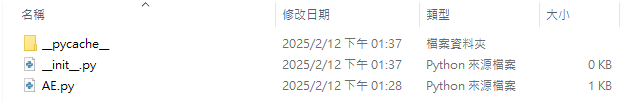
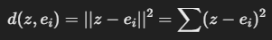
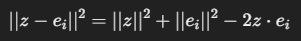

# Issues  
記錄我做這個project時遇到的問題, 不管我有沒有解決哈哈  


## 消除vscode的黃色warning底線  
這個我在網路上找到一些但試了之後黃色底線還是在  
然後網路上有人說習慣比解決更容易所以我就沒試了XD  
但如果有人知道希望可以告訴我因為我有強迫症看了好不爽哈哈  


## 重新命名anaconda的虛擬環境 
建一個新環境, 然後把舊環境刪掉  
``` 
conda create --name 新環境名字 --clone 舊環境名字  
```
我環境裡面有裝pytorch相關的東西, 我感覺會很麻煩所以我沒用哈哈  


## 如何讓一個檔案呼叫到一個資料夾底下某個檔案中的class或funtion  
e.g. 假設我要在main.py呼叫model資料夾底下AE.py檔案中的autoencoder類別  
在main.py中加上
```python
from model.AE import autoencoder
```
另外，在model資料夾中新增 \_\_init\_\_.py 這個檔案，讓python可以辨識model這個資料夾是一模組  
\_\_init\_\_.py中可以不用寫東西  
e.g.  



## CNN-Conv2d知識點:  
```python
nn.Conv2d(1, 32, kernel_size=3, stride=2, padding=1)
```
+ stride=2: 圖片尺寸縮小一半, 用stride=1+MaxPool2d(2,2)有一樣的效果  
+ conv2d 卷積輸出尺寸計算公式:  
  


## VAE知識點:  
###  VAE 架構  
+ VAE 的結構分為 Encoder、Latent Space（隱變數空間）和 Decoder 三部分：   
    Encoder: 將輸入壓縮成潛在空間（latent space）的參數（均值 μ 和標準差 σ）    
    Latent Space: 使用 reparameterization trick 從常態分佈中取樣 z    
    Decoder: 將 z 解碼回原本的數據空間  

+ VAE 的 loss 由兩部分組成：  
  

+ VAE model Reparameterization:  
```python
def reparameterize(self, mu, logvar):
        std = torch.exp(0.5 * logvar)  # 計算標準差 σ
        eps = torch.randn_like(std)  # 取標準常態分布的隨機數
        return mu + eps * std  # 𝑧 = 𝜇 + 𝜎 * 𝜖
```
std = torch.exp(0.5 * logvar)  
計算標準差 σ:  
  

+ KL-divergence:   
定義: 衡量兩個機率分佈的差異，值越小表示兩者越接近  
KLD loss計算公式:  
  
```python
kl_loss = -0.5 * torch.sum(1 + logvar - mu.pow(2) - logvar.exp())
```


## VQ-VAE知識點: 
### 定義
VQ-VAE(Vector Quantized Variational Autoencoder):  
主要透過 向量量化(Vector Quantization, VQ)來強制 Encoder 的輸出落入一個離散的 Codebook  
這樣可以學到離散的表示（像 Word2Vec 的詞向量），讓生成模型（如 PixelCNN, Transformer）可以更有效地建模  

### VQ-VAE 架構
VQ-VAE 的神經網路主要分成三部分:  
    Encoder: 把輸入 x 壓縮成一個潛在向量 z  
    VectorQuantizer: 把 z 映射到 Codebook，產生量化後的 z_q  
    Decoder: 用 z_q 還原原始輸入 x'  

### 找跟z最近的codeword
在 VQ-VAE 中，希望將z量化成Codebook中最接近的Codeword，這可以透過L2距離(歐幾里得距離, Euclidean Distance)來衡量: 
  
可以展開為:  
  
